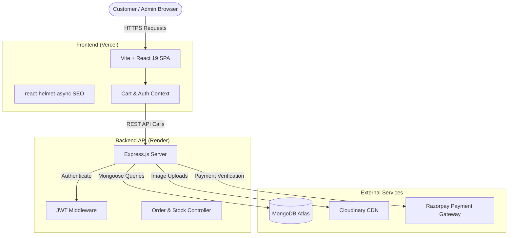

# 🍼 NK ENTERPRISES — Organic Baby Care E-Commerce

> A full-stack e-commerce web application dedicated to premium, certified organic baby care products, clothing, nursery furniture, and essentials.

🌐 **Live Demo**: [https://nk-enterprises.vercel.app](https://nk-enterprises.vercel.app) *(Placeholder)*

---

## 🛠️ Tech Stack


---

## ✨ Features

### 🛍️ Customer Experience
- **Product Discovery & Filtering**: Real-time search with debouncing, category filter selection, age-group filters (`0-6m`, `6-12m`, `1-3y`), price range sliders, and sorting options.
- **Product Detail & Customer Reviews**: Multi-image interactive gallery, product specifications, verified customer star ratings, and review submission.
- **Shopping Cart & Wishlist**: Dynamic cart state management, quantity stepper, promo/coupon code validation, and wishlist persistence.
- **Secure Checkout & Razorpay Integration**: Saved shipping addresses, custom delivery address form with validation, Razorpay online gateway integration, and Cash on Delivery (COD) fallback.
- **User Accounts & Order History**: Authentication with JWT tokens, user profile editing, address book management, and order status tracking.
- **SEO & Performance Optimized**: Dynamic titles and meta descriptions per page via `react-helmet-async`, image lazy loading (`loading="lazy"`), and code splitting via `React.lazy` + `Suspense`.

### 🛡️ Admin Control Panel
- **Analytical Dashboard**: Overview of total revenue, total orders placed, product count, and recent transactions.
- **Product Management**: Full CRUD operations for products, image uploading via Cloudinary integration, stock level management, and featured bestsellers toggle.
- **Category Management**: Create and manage categories with automatic URL slug creation.
- **Order Fulfillment**: Review customer orders, inspect payment verification statuses, and update fulfillment progress (`placed` ➔ `packed` ➔ `shipped` ➔ `delivered`).

---

## 🏗️ System Architecture



---

## 📸 Screenshots

*(Placeholders for application UI screenshots)*

| Storefront Home Page | Product Listing & Filters |
|---|---|
|  |  |

| Secure Checkout & Payment | Admin Dashboard |
|---|---|
|  |  |

---

## 💻 Local Setup & Installation

### Prerequisites
- Node.js 18+ and npm
- Local MongoDB instance or MongoDB Atlas URI

### 1. Clone Repository
```bash
git clone https://github.com/SanketManav9620/NK-Enterprises.git
cd NK-Enterprises
```

### 2. Backend Setup
```bash
cd backend
npm install

# Create local environment file
cp .env.example .env
```
Fill in your `.env` variables:
```env
PORT=5000
NODE_ENV=development
MONGO_URI=mongodb://localhost:27017/nk_enterprises
JWT_SECRET=nk_enterprises_super_secret_jwt_key_2026
CLOUDINARY_CLOUD_NAME=your_cloud_name
CLOUDINARY_API_KEY=your_api_key
CLOUDINARY_API_SECRET=your_api_secret
RAZORPAY_KEY_ID=rzp_test_your_key
RAZORPAY_KEY_SECRET=your_razorpay_secret
FRONTEND_URL=http://localhost:3000
```
Start backend server:
```bash
npm run dev
```

### 3. Frontend Setup
```bash
# Open a new terminal
cd frontend
npm install --legacy-peer-deps

# Create local environment file
cp .env.example .env
```
Start frontend server:
```bash
npm run dev
```
Visit `http://localhost:3000` in your browser.

### 4. Running Test Suites
- **Backend Tests (Jest + Supertest + mongodb-memory-server)**:
  ```bash
  cd backend
  npm test
  ```
- **Frontend Tests (Vitest + React Testing Library)**:
  ```bash
  cd frontend
  npm test
  ```

---

## 🚀 Future Improvements (What I'd Improve with More Time)

1. **Search Indexing**: Integrate Algolia / Elasticsearch for fuzzy search and instant search recommendations.
2. **Performance Caching**: Add a Redis caching layer for hot product queries and categories to reduce DB hits.
3. **Real-Time Order Tracking**: Implement WebSockets (`Socket.io`) for real-time delivery status updates.
4. **End-to-End Browser Testing**: Add a Playwright test suite for automated cross-browser testing.
5. **Localization & Multi-Currency**: Add internationalization (i18n) and multi-currency support.

---

## 📄 License
Distributed under the MIT License. See `LICENSE` for more information.
